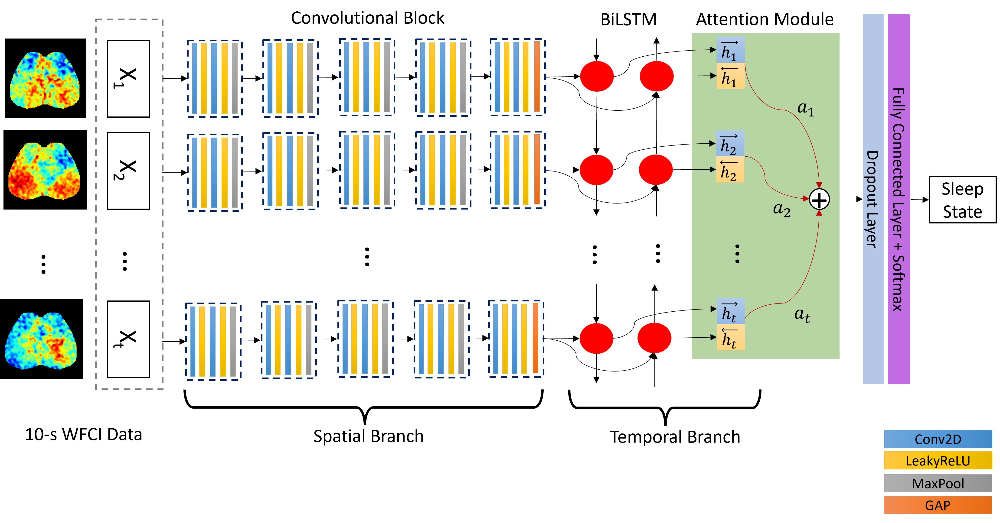

# Attention-Based CNN-BiLSTM for Sleep States Classification of Spatiotemporal Wide-Field Calcium Imaging Data
- Author:
  - Xiaohui Zhang (University of Illinois at Urbana-Champaign, xiaohui8@illinois.edu)
  - Eric C. Landsness (Washington University in St. Louis)
  - Jin-Moo Lee (Washington University in St. Louis)
  - Joseph P. Culver (Washington University in St. Louis)
  - Mark A. Anastasio (University of Illinois at Urbana-Champaign, maa@illinois.edu)  
## Introduction
The repository documented the code for implementing the attention-based bidirectional long short-term memory network to automatically classify sleep stages of spatial-temporal wide-field calcium imaging (WFCI) data. This is an extension of our previous work on applying multiplex visibility graph for automatic sleep stage classification of WFCI in order to achieve better interpretability of the model. The previous paper can be found [here](https://doi.org/10.1016/j.jneumeth.2021.109421).

## System Requirements
- Linux
- Miniconda >= 4.8.3
- MATLAB ([tightplot.m function](https://www.mathworks.com/matlabcentral/fileexchange/27991-tight_subplot-nh-nw-gap-marg_h-marg_w))
- Python 3.10.2. 
- Tensorflow 2.7.0.
- CUDA 11.7
- SciPy, NumPy, scikit-image, sklearn, matplotlib.
- [Focal loss package](https://github.com/artemmavrin/focal-loss).

The conda environment including all necessaray packages can be created using file `environment.yml` in the repository:
```
conda env create --file environment.yml
```
## Dataset
Part of the WFCI data used in this paper is available on PhysioNet. To note, If you're using our data, please cite:
```
@article{landsness2021wide,
  title={Wide-field calcium imaging sleep state database},
  author={Landsness, Eric and Zhang, Xiaohui and Chen, Wei and Miao, Hanyang and Tang, Michelle and Brier, Lindsey and Anastasio, Mark and Lee, Jin-Moo and Culver, Joseph},
  journal={PhysioNet},
  year={2021}
}
```
## Code structure
```
└── Scripts
    ├── AtlasandIsbrain.mat
    ├── AttentionLayer.py
    ├── create_tfrecords_over_10s.py
    ├── create_tfrecords.py
    ├── dataloader_sleep_tfrecords_local.py
    ├── gradcam.py
    ├── main.py
    ├── model_dau_nores.py
    ├── mouse_split.json
    ├── train_tfrecords.sh
    ├── utils.py
    └── visualize_lstm_attention_weights.py
├── Results
    ├── fragmented_sleep.m
    ├── overlay_heatmap_gradcam.m
    ├── plot_gradcam.m
    ├── plot_hypnogram.m
    ├── plot_scoring_length.m
    ├── tight_subplot.m
    └── visualize_attention_weights.m
```
#### In the `Scripts` folder, these are mainly the scripts for training and testing of the bidirectional LSTM model. 
- `main.py`: the main python script to launch the network training, validation, testing, computing the Grad-CAM and extracting the temporal attention weights by defining the parameter `mode` in the config file `train_tfrecords.sh`.
- `create_tfrecords*.py`: data preprocessing code to create tfrecords from continuous WFCI recordings. When the requested epoch lenghth is large than 10 second, the code takes additional frames in the adjacent epochs to compose the final epoch, eg., take adjacent 5-second in the epoch N-1 and epoch N+1 to compose a 20-second length for epoch N. 
- `model_attention_bilstm.py`: code for building the hybrid attention-based bi-lstm model.
- `AttentionLayer.py`: TensorFlow wrapper functions for building various type of attention module, including the LSTM attention, the spatial [SimAM](http://proceedings.mlr.press/v139/yang21o.html) and [CBAM](https://doi.org/10.48550/arXiv.1807.06521) module. 
- `gradcam.py`: code to compute the [Grad-CAM](https://doi.org/10.48550/arXiv.1610.02391) heatmaps.
- `visualize_lstm_attention_weights.py`: code to visualize learned attention scores of each time steps in a given 10-s input.
- `mouse_split.json`: config file to define the train/validation/test split.
#### In the `Results` folder, these are mainly the MATLAB codes to analyze the sleep scoring results.
- 'plot_hypnogram.m': cpde to ploy color-coded hypnogram.
- `plot_gradcam.m`: overlay Grad-CAM heatmap on a selected frame with the help of function `overlay_heatmap_gradcam.m`.
- `fragmented_sleep.m`: code to calculate the number of sleep transitions and the average length in each of the sleep states.
- `visualize_attention_weights.m`: visualize the color-coded attention weights.
## Running the Code
- The main setup for running the code is running:
```
./train_tfrecords.sh
```
by setting the `mode` as `train` for training the network, `gradcam` for generating the Grad-CAM heatmap for given inputs and `attention_weights` for extacting the temporal attention scores.
## Citations
If you use our codes to investigating the functional brain network in WFCI, and/or the example data in your research, the authors of this software would like you to cite our paper and/or conference proceedings in your related publications.
```
TBD
```
